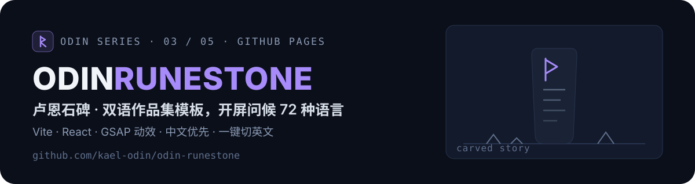

<p align="center">
  
</p>

<p align="center">
  <a href="https://kael-odin.github.io/odin-runestone/"></a>
  <a href="https://github.com/kael-odin/odin-runestone/actions/workflows/deploy-pages.yml"></a>
  
  
  
</p>

## ✨ 这是什么

中英双语的个人作品集模板（Vite + React + GSAP），像素级对齐 [thegr8binil.me](https://thegr8binil.me) 的观感：近黑底 + 米白字 + 紫青双色点缀。**中文默认**，右下角一键切英文。本站是 Kael Odin 的真实作品集，同时也是一份可直接复用的模板。

几个招牌交互：

- **SplashGate 开屏问候**：72 种语言各严格问候一次（9 秒窗口），每次来访都换个语言跟你打招呼
- **CellGrid 呼吸点阵**：Hero 背景的连续灰度闪烁点阵（`#666 → #ffffe3` 渐变）
- **TextAnimate 逐字动画**：挂载即动，切语言时以 children 为 key 重播
- **HashRouter 路由**：GitHub Pages 刷新子页面不 404

**线上地址**：<https://kael-odin.github.io/odin-runestone/>

## 🚀 快速开始

```bash
npm install
npm run dev      # 本地开发
npm run build    # 构建到 dist/，base 自动按仓库名注入
```

## 🎨 改成你自己的

| 想改什么 | 改哪里 |
| --- | --- |
| 全站文案（中/英） | `src/i18n/content.js`（文案一律进这里，勿硬编码） |
| 头像与图片资源 | `public/`（引用必须用相对路径，如 `src="Avatar.png"`） |
| 主题色板 | 近黑底 / 米白字 / `#a374ff` 紫 / `#17f1d1` 青 / `#ffd074` 黄，见全局样式 token |
| 语言切换逻辑 | `src/i18n/`（LanguageContext，zh 默认） |

## 🌐 部署

推送 `main` 自动走 `.github/workflows/deploy-pages.yml` 发布到 GitHub Pages。`vite.config.js` 在 CI 里按 `GITHUB_REPOSITORY` 自动注入子路径 base，改仓库名无需改代码。

## 🧭 Odin 系列

| 符 | 仓库 | 定位 | 访问 |
| --- | --- | --- | --- |
| 🌈 | [odin-bifrost](https://github.com/kael-odin/odin-bifrost) | 个人作品集主站（Next.js Bento） | [live](https://kael-odin.github.io/odin-bifrost/) |
| ⚡ | [odin-valhalla](https://github.com/kael-odin/odin-valhalla) | 深色作品集模板（React + Vite） | [live](https://kael-odin.github.io/odin-valhalla/) |
| 🗿 | **odin-runestone** | 双语作品集模板（Vite + GSAP） | 这里 |
| 📜 | [odin-saga](https://github.com/kael-odin/odin-saga) | 博客与数字花园（Next.js） | [live](https://odin-saga.vercel.app/) |
| 🏠 | [odin-heim](https://github.com/kael-odin/odin-heim) | OS 风互动主页模板（Vite） | [live](https://kael-odin.github.io/odin-heim/) |

> 同一套北欧神话命名 `odin-<词根>`，词根即职能：彩虹桥是入口，英灵殿陈列功绩，卢恩石碑刻生平，萨迦记事，heim 是家。

## 📄 致谢

- 上游项目：[aditya-raj-panjiyara/Aditya-s-Protfolio](https://github.com/aditya-raj-panjiyara/Aditya-s-Protfolio)（Vite + React + GSAP），参考站 [thegr8binil.me](https://thegr8binil.me) 在其基础上迁移打磨
- 参考站素材版权归原作所有，`public/ref-assets/` 仅供学习对照，请勿商用

---

<p align="center"><sub><b>ODIN SERIES</b> · bifrost / valhalla / runestone / saga / heim · crafted by <a href="https://github.com/kael-odin">Kael Odin</a></sub></p>
